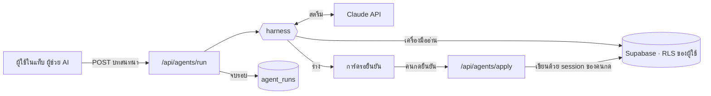

# ผู้ช่วย AI หลายบทบาท — Agent Harness

> โค้ด: `src/lib/agents/` · หน้าจอ: แท็บ **ผู้ช่วย AI** ในหน้าโปรเจกต์ · migration: `0024_agent_runs.sql`

## 1. Harness คืออะไร

โมเดลภาษา (Claude) ทำได้อย่างเดียว: **รับข้อความ → ตอบข้อความ** หรือตอบว่า "ขอเรียกเครื่องมือ X ด้วยค่านี้"
มันเรียกฐานข้อมูลเองไม่ได้ จำอะไรข้ามคำขอไม่ได้ และไม่รู้ว่าใครมีสิทธิ์ทำอะไร

**Harness คือโครงที่ห่อโมเดล** ให้กลายเป็น "เอเจนต์" ที่ทำงานได้จริง — ถ้าโมเดลคือเครื่องยนต์
harness คือตัวรถ: พวงมาลัย เบรก หน้าปัด และเข็มขัดนิรภัย

| ส่วนของ harness | ทำอะไร | อยู่ที่ไหน |
|---|---|---|
| ลูป (agent loop) | เรียกโมเดล → ถ้าขอเครื่องมือ รันให้ → ส่งผลกลับ → วนจนตอบจบ | `harness.ts` → `agentLoop` |
| เครื่องมือ | ฟังก์ชันที่โมเดลเรียกได้ พร้อมสเปกว่าควรเรียกเมื่อไหร่ | `specs.ts` (สิ่งที่โมเดลเห็น) · `tools.server.ts` (ตัวทำงานจริง) |
| บทบาท | คำสั่งประจำตัว + ชุดเครื่องมือ + สิทธิ์ที่ต้องมี | `roles.ts` · `prompts.ts` |
| สิทธิ์ | ใครใช้บทบาทไหน เครื่องมือไหนได้ | `archive-access.ts` + RLS |
| รั้วกั้น | จำกัดรอบ เวลา เงิน · ตรวจ input · การเขียนเป็นแค่ "ร่าง" | `harness.ts` · `proposals.ts` |
| การมอบงาน | ผู้ประสานงานเรียกผู้ช่วยเฉพาะด้านเป็น "เครื่องมือ" | `harness.ts` → `delegateTool` |
| บันทึก | ใคร บทบาทไหน เครื่องมืออะไร กี่ token กี่ดอลลาร์ | ตาราง `agent_runs` · แผงประวัติในแท็บ |

**หลักสำคัญ: "บทบาท" คือการตั้งค่า ไม่ใช่โปรแกรมแยก** — ผู้ช่วยทุกตัววิ่งบน harness ตัวเดียวกัน
สิ่งที่ทำให้ผู้จัดการงานต่างจากผู้ดูแลการเงินมีแค่ คำสั่งประจำตัว เครื่องมือที่หยิบได้ และสิทธิ์ที่ต้องมี
เพิ่มบทบาทใหม่จึงไม่ต้องแตะลูปเลย (ดูข้อ 7)

## 2. ภาพรวมระบบ



## 3. บทบาทที่มี

| บทบาท | ช่วยเรื่อง | เครื่องมือ | effort |
|---|---|---|---|
| 🧭 ผู้ประสานงาน | รับเรื่องทุกแบบ แจกให้ผู้ช่วยเฉพาะด้าน แล้วรวมคำตอบ | `delegate`, ภาพรวมโปรเจกต์ | low |
| 📋 ผู้จัดการงาน | งานค้าง งานเลยกำหนด ใครทำอะไร แตกงานย่อย | งาน, คน, นัดประชุม, **ร่างงาน** | medium |
| 💰 ผู้ดูแลการเงิน | งวดจ่าย ยอดค้างรับ ต้นทุน กำไร เงินสด | งวดจ่าย, รายการเรียกเก็บ, ต้นทุน/กำไร | medium |
| 🏗️ สถาปนิกระบบ | อธิบายผังระบบ วาดผังใหม่เป็น mermaid | ผัง, งาน, **ร่างผัง** | medium |
| 💬 ผู้ช่วยสื่อสาร | สรุปห้องคุยงาน ร่างข้อความตอบลูกค้า | ห้องคุย, นัดประชุม, คน, **ร่างข้อความ** | medium |

**effort** คือตัวคุมว่าโมเดลจะคิดละเอียดแค่ไหน — ผู้ประสานงานแค่แจกงานและสรุป จึงใช้ `low`
ส่วนผู้ช่วยเฉพาะด้านต้องวิเคราะห์ข้อมูลจริง ใช้ `medium`

## 4. หนึ่งคำถามเดินทางอย่างไร

ตัวอย่าง: *"สรุปสถานะโปรเจกต์ ทั้งงานค้างและเรื่องเงิน"* ถามผู้ประสานงาน

1. หน้าจอส่งบทสนทนา (ข้อความล้วน) ไป `/api/agents/run`
2. route ตรวจตามลำดับ: มีคีย์ API ไหม → รูปคำขอถูกไหม → ล็อกอินและเป็นคนในโปรเจกต์ไหม → มีสิทธิ์ใช้บทบาทนี้ไหม → ชนเพดานรายวันหรือยัง
   **ทุกด่านอยู่ก่อนจุดที่เริ่มเสียเงิน**
3. harness เรียก Claude พร้อมเครื่องมือของผู้ประสานงาน → Claude ตอบว่า "เรียก delegate สองครั้ง: ผู้จัดการงาน กับ ผู้ดูแลการเงิน"
4. harness รันผู้ช่วยทั้งสอง **พร้อมกัน** — แต่ละตัวเริ่มจากบริบทว่าง เห็นแค่งานที่ถูกมอบ มีลูปและเครื่องมือของตัวเอง
5. ผู้ช่วยแต่ละตัวเรียกเครื่องมืออ่านข้อมูล (ผ่าน RLS ของผู้ใช้) แล้วตอบกลับ
6. ผู้ประสานงานได้คำตอบสองชิ้น (ไม่ได้ผลเครื่องมือดิบทั้งหมด — บริบทจึงสั้น) แล้วสรุปรวม
7. ทุกอย่างสตรีมขึ้นจอทีละเหตุการณ์ (NDJSON · `protocol.ts`) · จบแล้วเขียนหนึ่งแถวลง `agent_runs`

## 5. รั้วกั้น — ทำไมปล่อยให้ผู้ช่วยแตะข้อมูลจริงได้อย่างสบายใจ

**สิทธิ์สามชั้นซ้อนกัน**
1. harness ไม่ยื่นเครื่องมือที่ผู้ใช้ไม่มีสิทธิ์ให้โมเดลเห็นตั้งแต่แรก (`exposedTools` ใน `specs.ts`)
2. ตอนโมเดลเรียก เช็คซ้ำอีกรอบ + ตรวจ input ด้วย zod
3. ทุก query ใช้ session ของผู้ใช้ — RLS ของ Supabase เป็นด่านสุดท้าย และทุก query ล็อก `project_id` ไว้ที่โปรเจกต์ที่เปิดอยู่

→ ผู้ช่วยเห็นได้ **ไม่เกิน** ที่คนที่กดใช้เห็นได้เองจากหน้าเว็บ

**ผู้ช่วยเขียนข้อมูลเองไม่ได้เลย** — ทำได้แค่ "ร่าง" (`propose_*`) ขึ้นเป็นการ์ด คนต้องกดยืนยันเอง
แล้ว `/api/agents/apply` ตรวจร่างและสิทธิ์ใหม่ทั้งหมดก่อนเขียน เหตุผล: ข้อมูลที่ผู้ช่วยอ่านมีข้อความที่คนอื่นพิมพ์ปน
(ห้องคุยงาน รายละเอียดงาน) ถ้ามีใครแอบเขียนคำสั่งไว้ (prompt injection) อย่างมากที่สุดคือร่างแปลก ๆ โผล่มาให้เห็น
ไม่มีอะไรถูกบันทึกโดยไม่มีคนเห็นก่อน

**เพดาน** — กันทั้งลูปวนไม่รู้จบและค่า API บานปลาย

| เพดาน | ค่า | ถึงแล้วเกิดอะไร |
|---|---|---|
| จำนวนรอบคิดต่อบทบาท | `maxSteps` ใน `roles.ts` | รอบสุดท้ายห้ามเรียกเครื่องมือ ให้สรุปจากที่มี |
| เวลาต่อคำถาม | `maxDuration` ของ route − 10 วิ | เหลือ 15 วิ → สรุป · ผู้ช่วยที่ถูกมอบงานมีเส้นตายเร็วกว่า 12 วิ เผื่อเวลาให้ผู้ประสานงานรวมคำตอบ |
| เงินต่อคำถาม | `AGENT_MAX_USD_PER_RUN` (1$) | สรุปจากที่มี |
| จำนวนครั้งต่อวันต่อคน | `AGENT_DAILY_RUNS` (40) | ตอบ 429 |
| ความยาวบทสนทนา | 24 ข้อความ · ข้อความละ 8,000 ตัวอักษร | ให้เริ่มสายใหม่ (ไม่ตัดของเก่าทิ้งเงียบ ๆ) |

**ไม่เก็บข้อความที่คุยกัน** — `agent_runs` เก็บแค่ใคร บทบาทไหน เครื่องมืออะไร token และเงิน (ลดภาระ PDPA)

## 6. ติดตั้ง

ทำ **ทั้ง dev และ prod** (บทเรียนเดิมจาก `deploy-prod.md`)

1. **ฐานข้อมูล** — Supabase → SQL Editor → วาง `supabase/migrations/0024_agent_runs.sql` → Run
   ตรวจผลที่ท้ายไฟล์: `เปิดRLS = true` · `policyที่มี = INSERT SELECT`
   (ยังไม่รัน = เส้น `/api/agents/run` ตอบ 503 บอกให้รัน migration — ตั้งใจปิดไว้ ไม่ใช่เปิดแบบไม่มีเพดาน)
2. **คีย์** — https://console.anthropic.com → API Keys → สร้างคีย์
   Vercel → Settings → Environment Variables → `ANTHROPIC_API_KEY` (Production + Preview)
   ⚠️ ห้ามตั้งชื่อขึ้นต้นด้วย `NEXT_PUBLIC_`
3. **สร้าง deployment ใหม่** — Vercel ผูก env กับ deployment ตอนสร้าง เพิ่มคีย์แล้วต้อง redeploy ถึงจะรับค่า
4. **ลอง** — ล็อกอินเป็นเจ้าของ → เปิดโปรเจกต์ → แท็บ **ผู้ช่วย AI**

ตัวเลือกเพิ่มเติม (ไม่ตั้งก็ได้): `AGENT_MODEL` · `AGENT_DAILY_RUNS` · `AGENT_MAX_USD_PER_RUN` — ดู `.env.example`

**ขยายเวลาให้ผู้ช่วย** — `maxDuration = 60` ใน `src/app/api/agents/run/route.ts` ใช้ได้ทุกแพ็กเกจของ Vercel
ถ้าโปรเจกต์เปิด Fluid Compute (ค่าตั้งต้นของโปรเจกต์ใหม่) แก้เป็น `300` ได้ ผู้ช่วยจะมีเวลาคิดและมอบงานมากขึ้น
เวลาของ harness คิดตามค่านี้เอง · ⚠️ ตั้งเกินที่แพ็กเกจยอม build จะไม่ผ่าน

## 7. เพิ่มบทบาทใหม่

ตัวอย่าง: อยากได้ "ผู้ตรวจคุณภาพงาน" ที่ดูงานกับไฟล์แนบ

1. `src/lib/agents/roles.ts` — เพิ่มแถวใน `ROLES` และเพิ่ม id ใน `RoleId`
   ```ts
   {
     id: "qa",
     label: "ผู้ตรวจงาน",
     icon: "🔍",
     blurb: "ตรวจว่างานที่ปิดแล้วครบตามที่ตกลงไหม",
     need: "project.tasks.view",
     tools: ["get_project_overview", "list_tasks", "get_task"],
     effort: "medium",
     maxSteps: 6,
     examples: ["งานที่ปิดสัปดาห์นี้มีอะไรตกหล่นไหม"],
   },
   ```
2. `src/lib/agents/prompts.ts` — เพิ่มคำสั่งประจำตัวใน `ROLE_PROMPTS` (ห้ามใส่วันที่หรือชื่อโปรเจกต์ ดูหัวไฟล์)
3. `pnpm audit:agents` — ตรวจว่าเครื่องมือที่อ้างถึงมีจริง สิทธิ์ไม่รั่ว ฯลฯ

แค่นี้ — แถบเลือกบทบาท ผู้ประสานงาน (มอบงานให้บทบาทใหม่ได้ทันที) และสมุดบันทึก รู้จักบทบาทใหม่เอง

## 8. เพิ่มเครื่องมือใหม่

1. `specs.ts` — สเปก: `label` · `description` (เขียนว่า **ควรเรียกเมื่อไหร่** ไม่ใช่แค่ทำอะไร) · `need` · `input` (zod)
2. `tools.server.ts` — ตัวทำงานใน `TOOL_IMPLS` ตามกฎหัวไฟล์:
   ใช้ `ctx.db` เท่านั้น · ทุก query `.eq("project_id", ctx.projectId)` · ไม่เขียนฐานข้อมูล · ส่งเฉพาะที่จำเป็น
3. อยากให้เปลี่ยนข้อมูล → ทำเป็น `propose_*` + เพิ่มชนิดร่างใน `proposals.ts` + ตัวบันทึกใน `apply.server.ts`
   + การ์ดใน `ProposalCard.tsx` · `need` ของเครื่องมือร่าง = สิทธิ์ "แก้" (audit เช็คให้)
4. ใส่ชื่อเครื่องมือใน `tools` ของบทบาทที่ควรมี → `pnpm audit:agents`

## 9. ค่าใช้จ่าย

รุ่นตั้งต้น `claude-opus-5`: $5 ต่อล้าน token ขาเข้า · $25 ต่อล้าน token ขาออก (ราคา ณ มิ.ย. 2026 เช็คที่ anthropic.com/pricing)

- ส่วนที่เหมือนเดิมทุกคำถาม (คำสั่งประจำตัว + สเปกเครื่องมือ) ถูก cache ไว้ อ่านซ้ำจ่ายราว 10%
  — ดู `cache %` ในแผงประวัติ ยิ่งสูงยิ่งประหยัด
- ประมาณคร่าว ๆ: ถามผู้ช่วยเฉพาะด้านตรง ๆ ราว **$0.03–0.10** ต่อคำถาม ·
  ผู้ประสานงานที่มอบงานสองคน ราว **$0.10–0.40** — ตัวเลขจริงดูที่แผง "ประวัติการทำงานของผู้ช่วย"
- ลดค่าใช้จ่าย: ถามผู้ช่วยเฉพาะด้านตรง ๆ แทนผู้ประสานงานเมื่อรู้อยู่แล้วว่าเรื่องอะไร ·
  ลด `effort` ใน `roles.ts` · หรือตั้ง `AGENT_MODEL=claude-sonnet-5` (ถูกกว่าราว 2.5 เท่า)
- ยอดจริงดูที่ Anthropic Console — ตัวเลขในระบบเป็นประมาณการจาก `pricing.ts`

## 10. ทำไมเลือกทางนี้

มีสี่ทางที่จะสร้างเอเจนต์บน Claude:

| ทาง | ใครทำลูป | ใครดูแลเครื่อง | เหมาะกับ |
|---|---|---|---|
| **เขียนลูปเอง (ที่ใช้อยู่)** | เรา | เรา (Vercel) | ต้องแทรกกฎของเราระหว่างรอบ: สิทธิ์ เวลา งบ การมอบงาน |
| Tool Runner ของ SDK | SDK | เรา | เอเจนต์เครื่องมือเยอะ ที่ไม่ต้องคุมระหว่างรอบมาก |
| Claude Agent SDK | SDK (ตัวเดียวกับ Claude Code) | เรา | งานแก้ไฟล์/รันคำสั่ง — เว็บนี้ไม่ต้องใช้ |
| Managed Agents | Anthropic | Anthropic | งานยาวเป็นชั่วโมง งานตามตารางเวลา ต้องมีเครื่องให้รันโค้ด |

เว็บนี้ทุกอย่างอยู่ใน Supabase ที่มี RLS อยู่แล้ว สิ่งที่ต้องการคือลูปที่เคารพสิทธิ์ของผู้ใช้ทุกก้าว
และจบในเวลาของ serverless function — ลูปที่เขียนเองสั้นพอจะอ่านจบ (`harness.ts`) และคุมได้ทุกจุด

## 11. ทดสอบ

- `pnpm audit:agents` — ตรวจโครงแบบไม่เรียกโมเดล: บทบาท↔เครื่องมือ สิทธิ์ลูกค้าไม่เห็นต้นทุน
  ร่างที่ร่างได้ต้องบันทึกได้ schema ของเครื่องมือ ค่าคงที่ตรงกับ CHECK ใน migration ราคา และตัวตัดสตรีม
- ลูปจริงทดสอบกับ Claude API จำลอง (SSE ปลอม) + Supabase จำลองแล้ว: เรียกเครื่องมือ มอบงานพร้อมกัน
  ร่างที่ผิดแล้วแก้ JSON พัง หมดเวลา ครบรอบ งบหมด ถูกปฏิเสธ ผู้ใช้กดหยุด และคีย์ผิด

## 12. ต่อยอด

- **ให้ลูกค้าใช้ด้วย** — เพิ่ม `"project.agents.use"` ในรายการ `client` ของ `archive-access.ts` บรรทัดเดียว
  ลูกค้าจะได้เฉพาะบทบาท/เครื่องมือที่สิทธิ์ถึง (ไม่เห็นต้นทุน ร่างงานไม่ได้ — audit เช็คไว้แล้ว) แต่เป็นค่า API ที่เราจ่าย
- **ผู้ช่วยคัดกรองคำขอ** ที่หน้า `/requests` — ต้องเป็นขอบเขตระดับเว็บ (ไม่ใช่ต่อโปรเจกต์) จึงต้องมี route ของตัวเอง
- **ผู้ช่วยตามตารางเวลา** เช่นสรุปงานทุกเช้าส่งอีเมล — ทำแบบ `cron_meeting_reminders.sql` ได้
  แต่ cron ไม่ได้เป็นผู้ใช้คนไหน ต้องใช้ service key (ข้าม RLS) = ต้องออกแบบสิทธิ์ใหม่ อย่าเอา harness นี้ไปใช้ตรง ๆ
- **ชุดทดสอบคุณภาพคำตอบ (eval)** — เก็บคำถามจริงกับคำตอบที่ดีไว้ แล้วรันเทียบทุกครั้งที่แก้ prompt
